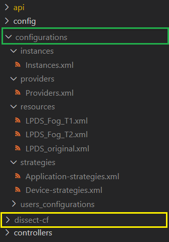

# DISSECT-CF-Fog-WebApp: Server

This server is part of DISSECT-CF-Fog-WebApp. It is written in Node.js with Express.js and MySQL.
It uses the [DISSECT-CF-Fog java application](https://github.com/andrasmarkus/dissect-cf), which generates the configuration's result.

## Setup the server
Basicly there are the required folders and files for running the server. The basic resource files are provided, and also the DISSET-CF-Fog java application too (from refactor branch with [a49f55e044](https://github.com/andrasmarkus/dissect-cf/commit/a49f55e044e9294ca84d871070a5b3ad1d9de7ce) commit - 26.09.2020) But in few points there are the required settings for the server:

- Create/ modify **dissect-cf** folder for the java application directly into the *dissect-cf-fog-server* folder. The folder's name should be dissect-cf. You can download the app from [here](https://github.com/andrasmarkus/dissect-cf)
- Create/modify **configurations** folder for configurations and for resources directly into the *dissect-cf-fog-server* folder. The folder's name should be configurations.
- Create/modify another folders for resources inside the configurations folder:
  - **instances** - and create/modify file **Instances.xml** with the instances.
  - **providers** - and create/modify file **Providers.xml** with the providers.
  - **resources** - and create/modify **xml** files for cloud resources (e.g.: LPDS_Fog_T1.xml, LPDS_Fog_T2.xml)
  - **strategies** - and create/modify xml files like:
    - **Application-strategies.xml** - for application's strategies
    - **Device-strategies.xml** - for device's strategies
    - The xml file should be look like that:
        ```xml
        <?xml version="1.0" encoding="UTF-8"?>
        <strategies>
          <strategy>random</strategy>
          <strategy>distance</strategy>
        </strategies>
        ```
  - **user_configurations** - this folder conatins the users folders  

The setup should be look like that:  


## Development server

Run `npm run start` for running the server on the 3000 port.
